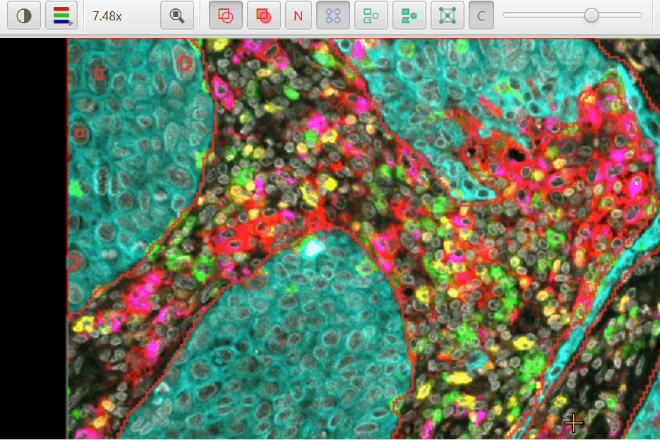

# QuPath Extension: Channel Names Viewer

A small always-visible legend window for [QuPath](https://qupath.github.io/) that lists the currently-selected fluorescence channels, color-coded by display color, and updates live as you toggle channels in QuPath's brightness/contrast dialog. The window resizes freely and the channel-name text scales with the window so you can shrink the legend out of the way on a laptop or blow it up for a presentation.

This extension packages [Sara McArdle's `FluorescentChannelNames.groovy`](https://github.com/saramcardle/Image-Analysis-Scripts/blob/master/QuPath%20Groovy%20Scripts/FluorescentChannelNames.groovy) (originally written by Pete Bankhead at the 2022 QuPath Hackathon) as a real extension with a toolbar button, menu item, and keyboard accelerator, plus polish around image switching, RGB-image handling, and listener cleanup.

---

## Requirements

- QuPath 0.7.0 or later
- JDK 21 (only required if you build from source)

---

## Installation

For v1.0 the extension is distributed as a single jar:

1. Download `qupath-extension-channel-names-viewer-{version}-all.jar` from the [Releases page](https://github.com/uw-loci/qupath-extension-channel-names-viewer/releases).
2. Drag the jar onto a running QuPath window.
3. When QuPath asks whether to copy the jar into your extensions folder, accept.
4. **Restart QuPath.** This step is required — QuPath copies the jar but does not load new extensions on the fly, so the toolbar button, menu entry, and keyboard shortcut will not appear until QuPath is fully restarted.

After restart you will see the new toolbar button next to QuPath's brightness/contrast button, a new menu entry under **Extensions > Channel Names Viewer...**, and the keyboard shortcut `Ctrl+Shift+C` (`Cmd+Shift+C` on macOS) ready to open the legend.

---

## Quick start

1. Open a multiplex / fluorescence image in QuPath.
2. Open the legend with any of the three launch surfaces: click the toolbar button (the channel-bars icon, three colored bars, with a small triangle in the bottom-right corner indicating an extra menu) next to brightness/contrast, choose **Extensions > Channel Names Viewer...**, or press **Ctrl+Shift+C** (`Cmd+Shift+C` on macOS).
3. The legend lists the currently-selected channels, each name drawn in its display color.

4. **Move:** drag the body. **Resize:** drag any edge or corner (the cursor changes within ~8 px of an edge). **Close:** double-click the body, press the shortcut again, or press Esc. **Settings:** right-click the body or the toolbar button for a menu with background opacity and a lock-font-size toggle.

---

## Key concepts

- **Selected channels.** The window mirrors what brightness/contrast calls *selected*. Toggle a channel there and the legend updates immediately.
- **Color coding.** Channel names are drawn in their display colors. A perceived-brightness (BT.601) luminance check switches very dark channels to white so they stay readable on the dark window background.
- **Resize-with-text.** No font-size control by default. Drag any edge or corner — text scales with the window. If you want a fixed size (e.g. matched screenshots across different channel counts), use **Lock font size** in the right-click menu.
- **Right-click for settings.** The window has no chrome and no controls bar. Right-click the toolbar button (without opening the window), or right-click the window body, to access background opacity, lock-font, and reset-opacity.
- **Image switching.** Open a different image and the legend rebinds automatically. RGB / brightfield images render an empty-state placeholder rather than a crash.

---

## Channel tools

Two tools for multichannel fluorescence display open from **Extensions > Channel Names Viewer**, and from the right-click menu of the toolbar button or the legend window.

### Background-aware auto contrast

QuPath's **Auto** sets each channel's display range from percentiles of all its pixels, so the minimum sits *below* the background. Every channel then paints a little colour over the whole image, and with many channels (an 18-channel Orion panel, say) those contributions add up to a grey haze that hides the cells.

This tool reads the shape of each channel's histogram instead. In a typical marker channel most pixels are background: a tall, narrow peak at a low value, whose rising (left) edge is pure noise. The tool finds that peak, measures its noise width from the rising edge, and puts the display **minimum** that many noise widths above the peak (3 by default, adjustable), so background renders black. The **maximum** is set so a small percentage of the pixels above the minimum saturate (0.5% by default).

- Pixels are sampled at full resolution from a 6 x 6 grid of tiles across the image (about a million per channel), so the noise width is the one you see when zoomed in; a downsampled read averages noise away and would set the minimum too low.
- A channel whose tallest peak is not a narrow background peak -- a dense nuclear stain covering a solid tissue field -- falls back to percentiles, and the table says so.
- Each channel's row shows its histogram with the background peak (grey), minimum (orange) and maximum (blue) marked.
- Ranges apply to the viewer as you change the settings; **Revert** restores the ranges the channels had before. **Resample** re-reads the pixels after moving to another z-slice or timepoint.

On the 18-channel Orion crop used to test it, QuPath's Auto placed each channel's background at 1.5-15% of display brightness; with the background-aware minimum, the share of near-white pixels in the 18-channel composite fell from 95% to 35%.

### Channel color wheel

Colours the visible channels with evenly spaced hues around a colour wheel -- one spoke per channel, 360/N degrees apart. Drag any spoke to rotate all the colours together. The wheel can be **HSV** (with a Value control) or **CIELAB** (perceptually uniform, at a chosen lightness L*, using the most saturated in-gamut colour for each hue). **Spread neighbouring channels apart** gives channels listed next to each other colours far apart on the wheel. Like Brightness/Contrast, colours apply as you change them; **Revert** restores the colours the channels had when the window opened, and **Copy script** copies a Groovy `setChannelColors(...)` script for other images with the same channels.

The colour wheel is a port of Sara McArdle's [Channel Color Chooser](https://saramcardle.github.io/ColorWheelPicker/) (MIT License).

---

## Coexistence with the original Groovy script

This extension does not replace [Sara McArdle's `FluorescentChannelNames.groovy`](https://github.com/saramcardle/Image-Analysis-Scripts/blob/master/QuPath%20Groovy%20Scripts/FluorescentChannelNames.groovy). Both can be installed at once — they create independent JavaFX windows and do not conflict. Keep using the script if you have customized it or wired it into automation; otherwise the extension adds discoverability (toolbar / menu / shortcut), resize-with-text scaling, clean rebinding on image switch, an RGB empty state, listener cleanup, persisted position/size/opacity/lock-state, and a right-click settings menu. Sara's script does not register a global accelerator at all, so `Cmd/Ctrl+Shift+C` is exclusive to the extension. Full discussion in the [user guide](docs/user-guide.md).

---

## What's new

**v1.1.0** — New channel tools: background-aware auto contrast (display minimum set from each channel's background peak, removing the haze many channels add up to) and a channel colour wheel (port of Sara McArdle's Channel Color Chooser). See [Channel tools](#channel-tools).

**v1.0.9** — Toolbar button icon redesigned from the `Ch` text glyph to a theme-aware three-bar icon.

**v1.0.8** — Dark-channel contrast assist is now gated to dark channels only (BT.601 luminance below the threshold); added an optional "Backdrop panel on dark channels" toggle.

**v1.0.7** — Channel names render in their literal channel color, with an optional white outline for contrast.

**v1.0.6** — Added a "preserve channel order" preference; channel names and colors now update live as you edit them.

**v1.0.5** — Toolbar-button dropdown indicator (the corner triangle) added; documentation refresh.

**v1.0.4** — Real translucent background (the rgba slider was being layered over an opaque pane in v1.0.3, so it only darkened the gray rather than letting the desktop show through). Edge and corner resize on all eight sides; the corner grip indicator was removed.

**v1.0.3** — Switched the window to `StageStyle.TRANSPARENT` with rounded corners (matching the original Groovy script aesthetic). Added a right-click context menu (background opacity slider, lock-font-size toggle, reset opacity) accessible from the window body and the toolbar button. Background opacity persists across sessions.

**v1.0.2** — Smart default geometry on open: window auto-sizes to the longest current channel name at QuPath's *Location text font size* preference. Saved geometry is restored only when *Lock font size* is checked.

**v1.0.1** — Toolbar button injection lookup uses the `ActionTools` action property (was looking up the wrong key). Keyboard accelerator routes through `QuPathGUI.setAccelerator` so it fires globally. Font size is now driven by window height (not width); added the *Lock font size* toggle.

**v1.0.0** — First release: toolbar button, menu item, accelerator, channel-color rendering with WCAG fallback, image-switch rebinding, RGB empty state, persisted position/size.

Toolbar button placement remains best-effort; if QuPath reorganizes its toolbar in a future release the menu item and keyboard shortcut continue to work.

---

## Links

- [User guide](docs/user-guide.md) — three ways to launch, image-switching behavior, the resize-with-text rationale, troubleshooting
- [Developer guide](docs/developer-guide.md) — architecture, listener lifecycle, building from source
- [GitHub Issues](https://github.com/uw-loci/qupath-extension-channel-names-viewer/issues) — bug reports and feature requests
- [image.sc forum](https://forum.image.sc/) — discussion and support; tag `#qupath` and mention `@Mike_Nelson`

---

## License

Apache License 2.0. Copyright 2026 Regents of the University of Wisconsin-Madison. See [LICENSE](LICENSE).

**Author:** Mike Nelson — University of Wisconsin-Madison
**Version:** 1.0.9
