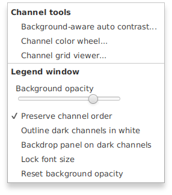
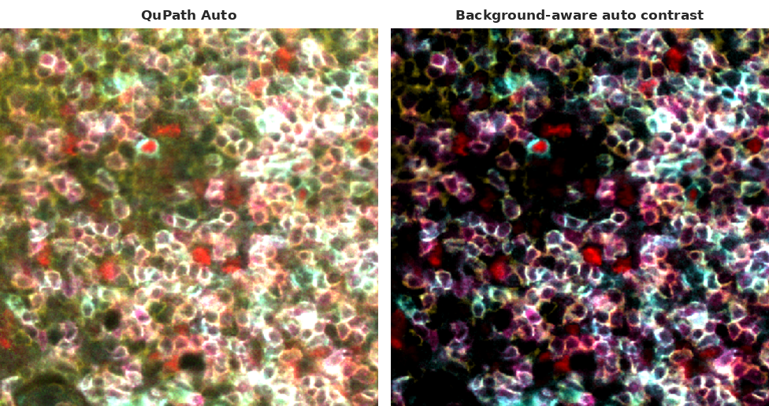

# QuPath Extension: Channel Names Viewer

A small always-visible legend window for [QuPath](https://qupath.github.io/) that lists the currently selected fluorescence channels, each name in its display color, and updates live as you toggle channels in QuPath's Brightness/Contrast dialog. The window resizes freely and the text scales with it, so you can shrink the legend out of the way on a laptop or blow it up for a presentation.

Version 1.1.0 adds three channel tools for multichannel fluorescence: [background-aware auto contrast](#background-aware-auto-contrast), a [channel color wheel](#channel-color-wheel), and a [channel grid viewer](#channel-grid-viewer).

This extension packages [Sara McArdle's `FluorescentChannelNames.groovy`](https://github.com/saramcardle/Image-Analysis-Scripts/blob/master/QuPath%20Groovy%20Scripts/FluorescentChannelNames.groovy) (originally written by Pete Bankhead at the 2022 QuPath Hackathon) as a real extension with a toolbar button, menu item, and keyboard shortcut, plus handling for image switching, RGB images, and listener cleanup.

---

## Requirements

- QuPath 0.7.0 or later
- JDK 21 or newer, only if you build from source (the build is tested on JDK 25)

---

## Installation

**From the extension catalog (recommended).** In QuPath, open **Extensions > Manage extensions**, add the catalog `https://github.com/uw-loci/qupath-catalog-mikenelson`, and install **Channel Names Viewer**. To update later, click the extension's gear icon (tooltip "Update extension") and choose the new version. After a new release, allow about 5 minutes before QuPath sees it, then restart QuPath.

**Manually:**

1. Download `qupath-extension-channel-names-viewer-{version}-all.jar` from the [Releases page](https://github.com/uw-loci/qupath-extension-channel-names-viewer/releases).
2. Drag the jar onto a running QuPath window, and accept when QuPath offers to copy it into your extensions folder.
3. **Restart QuPath.** QuPath does not load new extensions without a restart.

After the restart you will see:
- a new toolbar button (three colored bars) next to QuPath's Brightness/Contrast button;
- a new menu, **Extensions > Channel Names Viewer**;
- the keyboard shortcut `Ctrl+Shift+C` (`Cmd+Shift+C` on macOS).

---

## Quick start

1. Open a multiplex or fluorescence image in QuPath.
2. Open the legend: click the toolbar button, choose **Extensions > Channel Names Viewer > Channel Names Viewer...**, or press **Ctrl+Shift+C**.
3. The legend lists the selected channels, each name in its display color.

| To | Do this |
|---|---|
| Move the legend | Drag its body |
| Resize it | Drag any edge or corner (the cursor changes within about 8 px of an edge) |
| Close it | Double-click it, press Esc, or press the shortcut again |
| Change settings | Right-click the legend or the toolbar button |

---

## Key concepts

- **Selected channels.** The legend mirrors the channels selected in Brightness/Contrast. Toggle a channel there and the legend updates.
- **Color coding.** Channel names keep their display colors, even dark ones. For a dark channel such as a pure-blue DAPI, turn on **Outline dark channels in white** or **Backdrop panel on dark channels** in the right-click menu.
- **Text scales with the window.** Drag an edge or corner and the text follows. For a fixed size (for example, matched screenshots), use **Lock font size**.
- **The right-click menu** has two sections: **Channel tools** opens the three tools, and **Legend window** holds the legend's own settings.

---

## Channel tools

Open these from **Extensions > Channel Names Viewer**, or from the **Channel tools** section of the right-click menu. The [user guide](docs/user-guide.md#channel-tools) has step-by-step instructions, every setting, and troubleshooting.

### Background-aware auto contrast

QuPath's **Auto** sets each channel's display range from percentiles of all its pixels, which puts the minimum *below* the background. Each channel then adds a little color everywhere, and with many channels that adds up to a haze over the cells. This tool sets each channel's **minimum** just above its background peak (by default, background + 3 × noise), so background shows as black, and its **maximum** from the brightest pixels above that.

Opening the window applies the ranges at once; **Revert** restores the previous ones. Only display ranges change: pixel values and measurements are not affected.

### Channel color wheel

Gives the visible channels evenly spaced colors around a color wheel, one spoke per channel. Drag any spoke to rotate them all. The wheel is a port of Sara McArdle's [Channel Color Chooser](https://saramcardle.github.io/ColorWheelPicker/) (MIT License; see [THIRD-PARTY-NOTICES.md](THIRD-PARTY-NOTICES.md)).

### Channel grid viewer

A grid of panels that follow the main viewer as you pan, like QuPath's **View > Show channel viewer**, with extra options:
- show any channel, or all of them, in grayscale without changing the main viewer;
- give each saved display preset its own tile, such as "T cells" next to "Tumor";
- right-click an empty cell to show a display preset there;
- put a panel's channel or preset into the main viewer from the panel's right-click menu;
- remove panels you do not need.

---

## Coexistence with the original Groovy script

This extension does not replace [Sara McArdle's `FluorescentChannelNames.groovy`](https://github.com/saramcardle/Image-Analysis-Scripts/blob/master/QuPath%20Groovy%20Scripts/FluorescentChannelNames.groovy). Both can be installed at once; they create independent windows and do not conflict. The [user guide](docs/user-guide.md) lists what the extension adds.

---

## What's new

**v1.1.0** — Channel tools: background-aware auto contrast, a channel color wheel (port of Sara McArdle's Channel Color Chooser), and a channel grid viewer with grayscale panels and display-preset tiles (including presets added in empty cells). The right-click menu is now split into Channel tools and Legend window sections, and every menu item has a tooltip.

**v1.0.9** — Toolbar button icon redesigned from the `Ch` text glyph to a theme-aware three-bar icon.

**v1.0.8** — Dark-channel contrast assist is now gated to dark channels only (BT.601 luminance below the threshold); added an optional "Backdrop panel on dark channels" toggle.

**v1.0.7** — Channel names render in their literal channel color, with an optional white outline for contrast.

**v1.0.6** — Added a "preserve channel order" preference; channel names and colors now update live as you edit them.

**v1.0.5** — Toolbar-button dropdown indicator (the corner triangle) added; documentation refresh.

**v1.0.4** — Real translucent background (the rgba slider was being layered over an opaque pane in v1.0.3, so it only darkened the gray rather than letting the desktop show through). Edge and corner resize on all eight sides; the corner grip indicator was removed.

**v1.0.3** — Switched the window to `StageStyle.TRANSPARENT` with rounded corners (matching the original Groovy script aesthetic). Added a right-click context menu (background opacity slider, lock-font-size toggle, reset opacity) accessible from the window body and the toolbar button. Background opacity persists across sessions.

**v1.0.2** — Smart default geometry on open: window auto-sizes to the longest current channel name at QuPath's *Location text font size* preference. Saved geometry is restored only when *Lock font size* is checked.

**v1.0.1** — Toolbar button injection lookup uses the `ActionTools` action property (was looking up the wrong key). Keyboard accelerator routes through `QuPathGUI.setAccelerator` so it fires globally. Font size is now driven by window height (not width); added the *Lock font size* toggle.

**v1.0.0** — First release: toolbar button, menu item, accelerator, channel-color rendering with WCAG fallback, image-switch rebinding, RGB empty state, persisted position/size.

Toolbar button placement remains best-effort; if QuPath reorganizes its toolbar in a future release the menu item and keyboard shortcut continue to work.

---

## Links

- [User guide](docs/user-guide.md) — launching, the legend's settings, the channel tools step by step, troubleshooting
- [Developer guide](docs/developer-guide.md) — architecture, listener lifecycle, building from source
- [GitHub Issues](https://github.com/uw-loci/qupath-extension-channel-names-viewer/issues) — bug reports and feature requests
- [image.sc forum](https://forum.image.sc/) — discussion and support; tag `#qupath` and mention `@Mike_Nelson`

---

## License

Apache License 2.0. Copyright 2026 Regents of the University of Wisconsin-Madison. See [LICENSE](LICENSE). The channel color wheel is adapted from Sara McArdle's MIT-licensed Channel Color Chooser; see [THIRD-PARTY-NOTICES.md](THIRD-PARTY-NOTICES.md).

**Author:** Mike Nelson — University of Wisconsin-Madison
**Version:** 1.1.0
