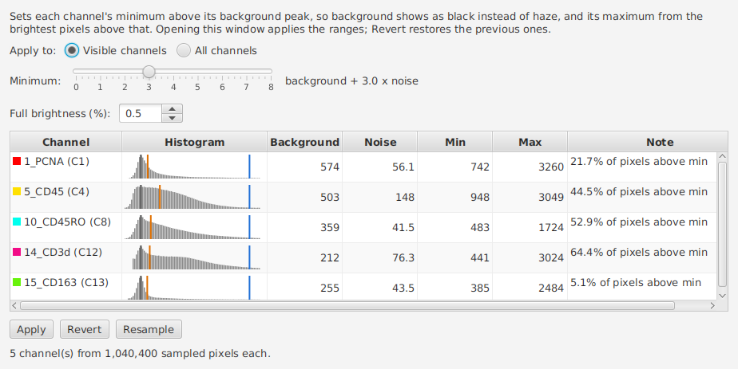
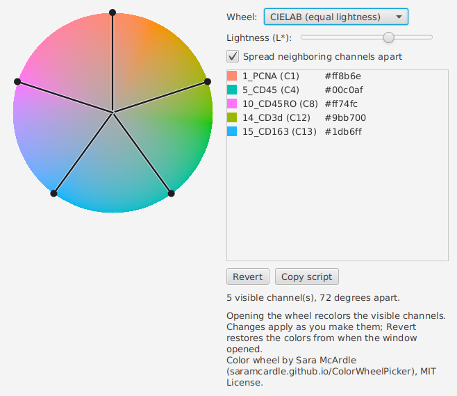
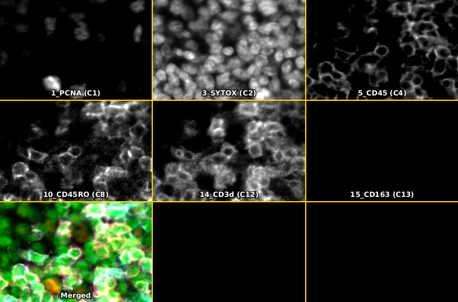
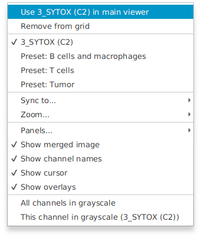
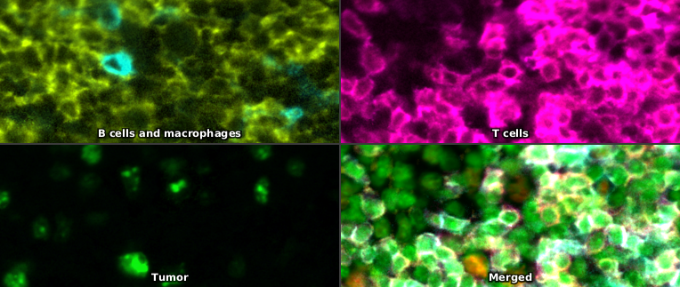

# Channel Names Viewer — User Guide

This guide walks through the legend window, then the three channel tools (auto contrast, color wheel, grid viewer), one task at a time. Sections are collapsible; expand the ones you need.

<details open>
<summary><strong>Getting started</strong> (read this first)</summary>

## Prerequisites

- A multiplex or fluorescence image is open in QuPath. The window mirrors the channel display, so it has nothing to show until an image with channels is loaded.
- For brightfield / RGB images the window opens with an empty-state placeholder rather than a crash. You can leave it open while you switch to a fluorescence image — the legend will populate on the next image load.

## First-run mental model

The window shows what QuPath's brightness/contrast dialog calls the *selected* channels — the ones currently contributing to the viewer. Toggle a channel in brightness/contrast and the legend updates immediately. The window itself is a chromeless rounded translucent panel; everything tunable lives in a right-click menu rather than a visible controls bar.


## Three ways to open the window

The launch surfaces, with their tooltip text:

- **Toolbar button** (three colored bars, with a small triangle in the bottom-right corner indicating that right-click reveals more): *Show or hide the channel-name legend (Ctrl/Cmd+Shift+C). Right-click for settings and channel tools.* The button sits immediately to the right of QuPath's brightness/contrast button.
- **Menu item** (**Extensions > Channel Names Viewer > Channel Names Viewer...**): *Show or hide a small window listing the channels shown in the viewer.*
- **Keyboard shortcut**: `Ctrl+Shift+C` on Linux and Windows, `Cmd+Shift+C` on macOS.

All three surfaces toggle: clicking when the window is showing closes it. Pressing the shortcut a second time has the same effect.

## Reading the legend

Each row in the window is one selected channel, drawn in its display color. With **Preserve channel order** on (the default), rows follow the image's channel order; off, they follow the order the channels were switched on.

Dark colors such as pure blue are hard to read on the dark background. Two options in the right-click menu help, and each applies only to channels darker than mid-gray: **Outline dark channels in white** draws a white halo around the name, and **Backdrop panel on dark channels** puts a light patch behind it.

## Window controls — at a glance

The window has no title bar, no buttons, no menu visible by default. It is intentionally minimal so it stays out of the way. Everything is gesture-based:

| Action | Gesture |
|---|---|
| Move | Click and drag the body |
| Resize | Click and drag any edge or corner (cursor changes within ~8 px of an edge) |
| Close | Double-click the body / press Esc / press the shortcut again / click the toolbar button |
| Open settings | **Right-click** the body — *or* right-click the toolbar button without opening the window |

</details>

<details>
<summary><strong>Open and close the window</strong></summary>

### Three launch surfaces

The toolbar button, menu item, and keyboard shortcut all do the same thing: toggle the legend window — open it if it is closed, close it if it is open. Hovering each surface shows its tooltip:

- **Toolbar button.** Three colored bars. The small triangle in the bottom-right corner is the same affordance QuPath uses on its line / polyline tool button: it indicates that right-clicking exposes additional options. Tooltip: *Show or hide the channel-name legend (Ctrl/Cmd+Shift+C). Right-click for settings and channel tools.*
- **Menu item.** **Extensions > Channel Names Viewer > Channel Names Viewer...** Tooltip: *Show or hide a small window listing the channels shown in the viewer.*
- **Keyboard shortcut.** `Ctrl+Shift+C` (`Cmd+Shift+C` on macOS). The shortcut is registered globally inside QuPath; it works whether the legend has focus or not.

### Closing

The window can be closed in any of these equivalent ways:

- Press the keyboard shortcut again.
- Click the toolbar button or menu item again (they toggle).
- Double-click anywhere on the body.
- Press **Esc** while the window has focus.

There is no native close button; the window is undecorated by design. The four equivalent close gestures above cover the same ground.

### What if I open it twice?

Re-opening the window when it is already visible brings it to the front rather than spawning a duplicate. There is only ever one legend window per QuPath session.

### Toolbar button missing on some installs

The toolbar button is best-effort. The extension finds QuPath's brightness/contrast button at install time and inserts itself immediately after. If a future QuPath release reorganizes the toolbar build sequence the button may not appear, in which case the menu item and keyboard shortcut continue to work normally. See the **Troubleshooting** section for diagnostic detail.

</details>

<details>
<summary><strong>Switch images while the window is open</strong></summary>

### Automatic rebinding

You do not need to close and reopen the legend when you switch images. Open a different image in QuPath and the window detaches from the previous image's channel display, attaches to the new image's display, and re-renders. This works whether you switch via **File > Open**, the project pane, or by selecting a different viewer in a multi-viewer split-pane layout.

### What you see for a non-fluorescence image

If the new image is brightfield, RGB, or otherwise has no fluorescence channels, the window does not close. It shows the empty-state placeholder. The headline is always *No fluorescence channels*; the subtitle changes depending on the cause:

- **No image is open**: *(open an image to see its channels)*
- **The active image is RGB / brightfield**: *(this image is RGB; channels do not apply)*
- **The image is fluorescence but you have no channels selected**: *(open Brightness/Contrast and select channels)*

Switching to a fluorescence image, or selecting a channel in brightness/contrast, makes the legend populate immediately — no need to relaunch.

### What "rebinding" means under the hood

The window listens to QuPath's notion of "the active image" rather than to a specific image. Whenever the active image changes, the window's connection to channel-display data is rebuilt. This is transparent to you, but it is the reason the legend keeps working across image switches in this extension; the original Groovy script does not handle this case and breaks when you change images.

</details>

<details>
<summary><strong>Move and resize the window</strong></summary>

### Drag to move

Click and drag the body of the window — there is no title bar. The cursor stays as the default arrow when over the body's interior; resize cursors only appear within ~8 px of an edge, so the move-vs-resize distinction is clear.

### Drag the edges to resize

Within ~8 px of any edge or corner the cursor switches to the matching resize cursor (N / S / E / W / NE / NW / SE / SW). Drag to resize from that edge or corner. There is no painted corner grip; the hot zones around the perimeter handle resize discovery.

### Position and size persistence

Window x, y, width, and height are saved between sessions. With **Lock font size** off (the default), the window opens centered on the QuPath window, sized to fit the current channels (longest channel name × number of rows) at QuPath's *Location text font size* preference. With it on, the saved position and size are restored. See the **Settings** section.

If a locked window's saved position is on a monitor that is no longer attached (an external display you only use at the office, for example), it is ignored and the window opens with its default size and position instead.

### Multi-monitor

Drag-to-second-monitor works as expected. The window honors the OS's native multi-monitor handling, including different DPI scales per display.

</details>

<details>
<summary><strong>Resize and the text-scales-with-window feature</strong></summary>

### What happens when you resize

Drag any edge or corner. The legend resizes; both the window dimensions and the channel-name text grow or shrink together. There is no separate font-size control by default — size is bound to window height divided by row count. If you want a *fixed* font size, see *Lock font size* in the **Settings** section below.

### Why this design

A scientist demoing on a projector wants the legend big enough to read from the back of the room. An analyst at a normal monitor wants it small and out of the way. The same control covers both: pull the corner. No menu to dig through, no preference to set.

The original Groovy script had a fixed font size. Resize-with-text-scaling is the headline polish item this extension adds.

### Bounds

Font size is clamped to a comfortable minimum (10 pt) and a sensible maximum (72 pt). Below the minimum, channel names start to clip and the empty-state subtitle wraps in ways that look broken; above the maximum, even on a 4K display, the channel rows look comically large. In practice you will not hit either bound during normal use; resizing into either limit has the visible effect of the text holding steady while the window keeps changing size.

### Aspect

The font scales with window *height* divided by row count, not with width. Stretching the window into a long thin rectangle widens the room for long channel names while keeping their height steady; shrinking the height squeezes the rows together. This avoids a common failure mode where the user widens the window to fit a long channel name and the text becomes comically tall.

</details>

<details>
<summary><strong>Settings — the right-click menu</strong></summary>

### Two right-click surfaces

The same menu opens in two places:

- **Right-click the legend window body.**
- **Right-click the toolbar button.** This works *without* opening the window — useful if you want to set background opacity or pre-lock the font size before the window is even visible. The small triangle in the bottom-right corner of the button is the visual cue that more is hidden behind right-click.

The menu has two sections. **Channel tools** opens the three [channel tools](#channel-tools). **Legend window** holds the legend's settings: **Background opacity**, **Preserve channel order**, **Outline dark channels in white**, **Backdrop panel on dark channels**, **Lock font size** and **Reset background opacity**.


There is no equivalent on the menu item or the keyboard shortcut — they only toggle the window open/closed.

### Background opacity (slider)

The slider controls the alpha of the window's near-black background, from 0.05 (nearly invisible — desktop / image shows through) to 1.0 (fully opaque). Default 0.75 matches the original Groovy script. The change is live: drag the slider and the background updates in real time. The window stays draggable and resizable at any opacity.

The slider stays open while you drag (it does not hide the menu on click), so you can fine-tune without re-opening the menu repeatedly. Click anywhere outside the menu to dismiss.

### Lock font size (checkbox)

Default: **off**. With lock off, every reopen recomputes the window's default geometry from the current channel set + QuPath's *Location text font size* preference, so a scientist who selects 4 channels then 12 channels gets two appropriately-sized windows.

Turn lock on when you want a fixed font (e.g. for matched screenshots across panels with different channel counts). Turning lock on captures the *current* on-screen font size. From then on, the saved width / height / lock state are restored on every reopen and the resize-with-text behavior is suppressed (the font stays at the locked value while the window resizes around it).

Turning lock off again restores the auto-fit behavior on the next open.

### Reset background opacity

Sets the slider back to the default 0.75. Convenient if you have nudged the slider to one extreme and want to return without scrolling the slider back manually.

### What is persisted

The following are persisted automatically when the window closes:

- Position (x, y) and size (width, height)
- Lock font size (boolean) and the locked font size value (pt)
- Background opacity
- Preserve channel order, and the two dark-channel options (saved as soon as you change them)

Persistence happens automatically when the window closes. There is no "save state" command and no "reset to defaults" UI; if you want to reset, clear QuPath's preferences for this extension via the standard QuPath preferences workflow.

### What is *not* persisted

The fact that the window was *open* on shutdown is not persisted. Each QuPath start has the window closed; you reopen it as needed. This avoids the "I closed QuPath, came back the next day, and an unwanted window popped up" surprise.

</details>

<a id="channel-tools"></a>

<details>
<summary><strong>Channel tools</strong>: auto contrast, color wheel, grid viewer</summary>

Three tools for multichannel fluorescence images. Open each from **Extensions > Channel Names Viewer**, or from the **Channel tools** section of the legend's right-click menu. Each opens in its own window and stays open while you work.

### Remove background haze: background-aware auto contrast

QuPath's **Auto** sets each channel's display range from percentiles of all its pixels, so the display minimum sits *below* the background. Each channel then adds some color everywhere, and with many channels that adds up to a haze over the cells. This tool sets each channel's minimum just above its background instead.


#### Steps

1. **Open a fluorescence image and select the channels to adjust** in Brightness/Contrast.
2. **Choose Extensions > Channel Names Viewer > Background-aware auto contrast...** The tool reads the image and applies the new ranges to the viewer right away. The table lists each channel, and the status line reads, for example, *5 channel(s) from 1,040,400 sampled pixels each.*
3. **If haze remains, drag Minimum to the right.** The viewer updates as you drag.
4. **To undo, click Revert.** The channels go back to the ranges they had before the tool changed them.



#### Settings

| Setting | Default | What it does |
|---|---|---|
| Apply to | Visible channels | Adjust only the channels shown in the viewer, or every channel. |
| Minimum | 3 (range 0 to 8) | How many noise widths above the background peak the minimum sits. Raise it for less haze; lower it to see more of the background. |
| Full brightness (%) | 0.5 (range 0 to 5) | Percent of the pixels *above the minimum* shown at full brightness. Raise it to brighten the channel. |

The settings are remembered between sessions.

**The table.** Values are in the image's own pixel units (gray levels).
- **Background**: the pixel value at the center of the background peak.
- **Noise**: the spread of the background, as a standard deviation. It is measured from the half width at half maximum of the peak's low side, which assumes Gaussian noise. If the background sits against the lowest value, as on background-subtracted data, the high side is used instead.
- **Min**: background + (Minimum × noise). Values at or below it show as black.
- **Max**: values at or above it show at full brightness.
- **Note**: how much of the channel is above the minimum, or why percentiles were used.

Hover over a histogram to see what its lines mean. The bars are pixel counts on a square-root scale; the dark gray line is the background peak, orange is the minimum, and blue the maximum.

#### How it works, and its limits

- **Sampling.** Pixels are read at full resolution from a 6 × 6 grid of 170-pixel tiles spread over the image, including its edges: about a million pixels per channel. A smaller image is read whole. Full resolution keeps the noise at the width you see when zoomed in. Only the current z-slice and timepoint are read; after moving to another, click **Resample**.
- **3 × noise.** On a Gaussian background, a minimum 3 noise widths up hides about 99.9% of background pixels. Autofluorescence often has a longer bright tail, which leaves more of it visible; raise **Minimum** if so.
- **Mostly-glass slides.** If tissue covers only a small part of the image, the background peak may be the glass rather than the tissue, and some tissue autofluorescence will remain. Small tissue pieces can also fall between the sampled tiles. Check each row's histogram.
- **Padding.** Pixels at a channel's lowest value are ignored when there are more of them than of the next value, since this is usually unscanned or padded area.
- **Display only.** Only display ranges change; pixel values, measurements and classifiers are not affected. The ranges are saved with the image's display settings when you save the image, and they affect rendered exports.
- **Per image.** Ranges are set from each image's own pixels, so do not compare channel brightness between images by eye. For matched ranges, save a display preset in Brightness/Contrast and apply it to each image.
- **Switching images.** After you open another image, the table fills in for the new image but nothing is applied until you click **Apply**. **Revert** works for the current image only.
- **Reproducibility.** The results are deterministic: the same image, z-slice, timepoint and settings give the same ranges. The ranges are written to the QuPath log (**View > Show log**) when the window opens and when you click **Apply**.

In one test on an 18-channel Orion crop, colored with 18 evenly spaced hues and default settings, the share of composite pixels whose red, green and blue were all above half brightness fell from 95% to 35%. QuPath Auto was approximated there as the 0.1st and 99.9th percentiles.

### Recolor channels: channel color wheel

Gives the visible channels evenly spaced colors around a color wheel: one spoke per channel, 360/N degrees apart. This is a port of Sara McArdle's [Channel Color Chooser](https://saramcardle.github.io/ColorWheelPicker/) (MIT License).

#### Steps

1. **Select the channels to recolor** in Brightness/Contrast.
2. **Choose Extensions > Channel Names Viewer > Channel color wheel...** Opening the window recolors the visible channels from the wheel straight away.
3. **Drag any spoke to rotate all the colors.** The viewer updates as you drag, and the colors are saved to the image when you release.
4. **To undo, click Revert.** The channels get back the colors they had when the window opened.



| Setting | Default | What it does |
|---|---|---|
| Wheel | HSV | **HSV**: pure hues. **CIELAB (equal lightness)**: hues of equal lightness L*, each as vivid as the screen allows, so no color is darker than another. |
| Value (%) / Lightness (L*) | 100% / 65 | How bright all the colors are. |
| Spread neighboring channels apart | Off | Gives channels that sit next to each other in the list colors far apart on the wheel, at least (N-1)/2 spokes apart. It has no effect with three or fewer channels. |

Changing which channels are visible while the window is open recolors the visible channels again.

**Copy script** copies a Groovy script that sets the same colors on other images. Colors are set by channel *position*, so use it only on images whose channels are in the same order. For the five channels above it reads:

```groovy
// Channel colors from the Channel Names Viewer color wheel (CIELAB, L* 70)
// Colors are set by channel position; null leaves a channel unchanged
// 1: 1_PCNA (C1)  #ff8b6e
// 4: 5_CD45 (C4)  #00c0af
// 8: 10_CD45RO (C8)  #ff74fc
// 12: 14_CD3d (C12)  #9bb700
// 13: 15_CD163 (C13)  #1db6ff
setChannelColors(ColorTools.packRGB(255, 139, 110), null, null, ColorTools.packRGB(0, 192, 175), null, null, null, ColorTools.packRGB(255, 116, 252), null, null, null, ColorTools.packRGB(155, 183, 0), ColorTools.packRGB(29, 182, 255), null, null, null, null, null)

import qupath.lib.common.ColorTools
```

### Compare channels side by side: channel grid viewer

A grid of panels that follow the main viewer as you pan, like QuPath's **View > Show channel viewer**. Panels use the main viewer's display ranges and colors, so changes in Brightness/Contrast and the auto contrast tool show up immediately.

#### Steps

1. **Choose Extensions > Channel Names Viewer > Channel grid viewer...** The grid shows one panel per visible channel, plus the merged image.
2. **Right-click a panel for its options.** The first item, **Use ... in main viewer**, shows that panel's channel (or preset) alone in the main viewer. The grid keeps its panels, so you can switch the main viewer between them.
3. **To check whether a cell is positive for several markers**, choose **Sync to... > Cursor** and turn on **All channels in grayscale**, then hover over the cell in the main viewer. Every panel shows the same spot.



#### The right-click menu, top to bottom

| Item | What it does |
|---|---|
| Use ... in main viewer | Show this panel's channel, or preset, in the main viewer. |
| Remove from grid | Take this panel out of the grid. The main viewer is not changed. Removed panels stay removed when you switch images. |
| Restore removed panels (N) | Bring back every removed panel. |
| *(channel name)* / Preset: ... | What this panel shows: its own channel, or any display preset that fits the image. |
| Sync to... | What the panels center on: the cursor (hold **Shift** to stop following), the viewer center, the selected object, or nothing. |
| Zoom... | Same as main viewer, or 400% to 1%. 100% is one image pixel per screen pixel. |
| Panels... | **Visible channels** (follows the main viewer), **All channels**, or **One per display preset**. |
| Show merged image, Show channel names, Show cursor, Show overlays | As in QuPath's channel viewer. |
| All channels in grayscale | Show every channel panel in grayscale; often easier to read than dark colors. The lines between panels turn yellow so the grid stays visible. The main viewer keeps its colors. |
| This channel in grayscale | The same for one panel, until you switch images. |



**Display presets.** A preset is a set of display settings (which channels are shown, their colors and ranges) saved in the project. Showing presets side by side lets you compare groups of markers as you pan:

1. **In Brightness/Contrast, show only the channels for one group** (for example CD3, CD4 and CD8), then click **Save** next to **Settings** and name it, for example *T cells*.
2. **Repeat for each group**, for example *Tumor* with Pan-CK and Ki-67.
3. **In the grid's right-click menu, choose Panels... > One per display preset.** Each preset gets a tile, next to the merged image.



A preset only appears if the current image has the same channels as the image it was saved from: the same number of channels with the same names. This is the same rule Brightness/Contrast uses for its **Settings** list. Presets saved, changed or deleted while the grid is open appear within about 2 seconds.

### Troubleshooting the channel tools

| What you see | Cause | Fix |
|---|---|---|
| *No narrow background peak (dense stain or empty channel) -- percentiles used* in the auto contrast table | The channel's histogram is a single broad peak with no narrow background below it. A dense stain covering the whole field (such as a nuclear stain on solid tissue) and a channel with no staining at all look the same. | For a dense stain, this is expected. For an unstained or negative-control channel, the 0.1st to 99.9th percentile range stretches its noise into haze: turn the channel off, or set its range by hand in Brightness/Contrast. **Full brightness** has no effect on these channels. |
| *Almost nothing above min -- channel may be empty* | Fewer than 0.2% of the sampled pixels are above the minimum. | Expected for a channel with little or no staining in this image; it stays black. |
| *This image is RGB; there are no channels to adjust.* | Brightfield or RGB image. | The tools work on fluorescence channels only. |
| *Could not read pixels: ...* | The image could not be read. | Check that the image opens in QuPath, and look in **View > Show log**. |
| The color wheel says *Select the channels to color in Brightness/Contrast.* | No channels are visible. | Select channels in Brightness/Contrast. |
| *Display presets need an open project.* / *No display presets in this project -- save one in Brightness/Contrast.* | Presets are saved in a project. | Open a project and save a preset (see **Display presets** above). |
| *No display preset in this project fits this image's channels.* | Every saved preset was made for an image with different channels. | Save a preset from an image with these channels. |
| *All panels were removed from the grid.* | Every panel was removed. | Right-click the message and choose **Restore removed panels**. |

</details>

<details>
<summary><strong>Coexistence with the original Groovy script</strong></summary>

### Both can be installed simultaneously

[Sara McArdle's `FluorescentChannelNames.groovy`](https://github.com/saramcardle/Image-Analysis-Scripts/blob/master/QuPath%20Groovy%20Scripts/FluorescentChannelNames.groovy) — originally written by Pete Bankhead at the 2022 QuPath Hackathon — remains a perfectly valid choice. Both the script and this extension can be installed at the same time. They each create their own JavaFX `Stage`; they do not share state, listeners, or window position. Using both at once gives you two windows with the same channel list, which is rarely useful but is harmless if you accidentally do it.

### What the extension adds over the script

- **Discoverability.** The script must be loaded into QuPath's script editor and run; the extension is a toolbar button, a menu item, and a keyboard shortcut.
- **Resize-with-text-scaling.** The script's font size is fixed; the extension scales font with window height (and offers a lock toggle for fixed-size matched screenshots).
- **Robust image-switch handling.** The script's listener binding is broken when you open a new image; the extension rebinds.
- **Empty-state for RGB images.** The script does not guard against non-fluorescence images and renders an empty pane; the extension renders an explanatory message.
- **Listener cleanup.** Closing the extension's window removes the channel-display listener; closing the script's window leaks one listener per show.
- **Persistence.** Position, size, font lock state, locked font size, and background opacity all persist across QuPath restarts.
- **Right-click settings.** Background opacity, channel order, dark-channel options, lock font, reset opacity. The script has no in-window controls.
- **Channel tools.** Background-aware auto contrast, a channel color wheel and a channel grid viewer, from the same menu.

The extension does not steal `Cmd/Ctrl+Shift+C` from the script — the script does not register a global accelerator at all — so the keymap stays clean even if both are installed.

</details>

<details>
<summary><strong>Troubleshooting</strong></summary>

### "Toolbar button is missing"

**What you see.** The menu item and keyboard shortcut work, but no button appears next to brightness/contrast.

**Cause.** The extension looks for QuPath's brightness/contrast button at install time and inserts itself immediately after. If QuPath reorganizes its toolbar in a future release, the lookup heuristic may fail. The extension logs a WARN entry when this happens; the QuPath log is at **View > Show log**.

**Fix.** Use the menu item (**Extensions > Channel Names Viewer > Channel Names Viewer...**) or the keyboard shortcut (`Ctrl+Shift+C`). File an issue with the QuPath version and a copy of the log excerpt; the toolbar lookup heuristic can be updated for the new layout.

### "Background is solid, slider does nothing"

**What you see.** The opacity slider in the right-click menu changes the background brightness but never makes it actually transparent.

**Cause.** This was a bug in v1.0.3 — the rgba background was painted on the inner content pane while the window's outer surface was opaque, so the slider only darkened that opaque layer.

**Fix.** Update to v1.0.4 or later. The rounded translucent fill is now painted on the root surface, so the slider produces real transparency.

### "Window does not update when I toggle channels"

**What you see.** Toggling a channel in brightness/contrast does not change the legend.

**Cause.** The most common cause is that the window was opened before any image was loaded — the channel-display binding has nothing to attach to. A less common cause is a regression in the listener-rebinding logic.

**Fix.** Close and reopen the window after the image is loaded. If the problem persists across multiple image switches, file an issue and include the QuPath log.

### "Text is too small / too large"

**What you see.** Resizing the window does not scale the text past a certain point.

**Cause.** Font size is clamped to a 10–72 pt range. The clamp prevents unreadable text at very small sizes and runaway scaling at very large sizes. This is intentional, not a bug.

**Fix.** Resize the window within the working range. If the maximum is too small for your specific use case (presenting on a 4K display from across a conference room, for example), file an issue with your screen size and DPI; the bounds can be revisited.

### "I want a fixed font for matched screenshots"

Turn on **Lock font size** in the right-click menu. The current font becomes the locked size and is restored on every reopen until you uncheck the option. Geometry is also restored when locked, so the window itself stays the same size between runs.

### "Window is off-screen on startup"

**What you see.** The window is supposed to be open but is not visible (saved position is on a monitor that is no longer attached, or DPI scaling changed in a way that pushes the window past the screen edge).

**Cause.** The saved position references a screen the OS no longer reports as attached.

**Fix.** This should auto-correct: a saved position that no longer touches any attached screen is ignored, and the window opens at its default position. If the window still does not appear, turn off **Lock font size** in the toolbar button's right-click menu; an unlocked window always opens centered on the QuPath window.

### "Why is my blue channel hard to read?"

**What you see.** A channel name in a dark color (pure blue, dark red, dark purple) is hard to read on the dark legend background.

**Cause.** Names are drawn in their channel's display color, and a dark color has little contrast against the near-black background.

**Fix.** Right-click the legend and turn on **Outline dark channels in white** or **Backdrop panel on dark channels**. Either applies only to channels darker than mid-gray. Or pick a lighter color for that channel in Brightness/Contrast.

### "Empty window shows when I open a new image"

**What you see.** The window is visible but contains a placeholder message instead of channel names — *No fluorescence channels* with one of three subtitles.

**Cause.** The active image is RGB or brightfield, no image is open, or the image is fluorescence but no channels are currently selected. This is intentional behavior.

**Fix.** Open a fluorescence / multiplex image, or select channels in **Brightness/Contrast**. The window updates automatically. The exact subtitle tells you which of the three causes is in play.

### "Right-click does nothing on Linux"

**What you see.** Right-clicking the body or the toolbar button does not open the settings menu.

**Cause.** Some Linux setups intercept right-click for compositor or window-manager actions before the application sees the event.

**Fix.** Try Shift+F10 with the window focused (the JavaFX context-menu shortcut on most platforms), or two-finger tap on a trackpad. If neither works, file an issue with your distribution, desktop environment, and Wayland-vs-X11 status.

### Anything else

For problems not covered here, please open an issue on the [GitHub Issues tracker](https://github.com/uw-loci/qupath-extension-channel-names-viewer/issues) with the QuPath version, the extension version, and a copy of the relevant log excerpt. General QuPath questions are best directed to the [image.sc forum](https://forum.image.sc/) with the `#qupath` tag.

</details>
